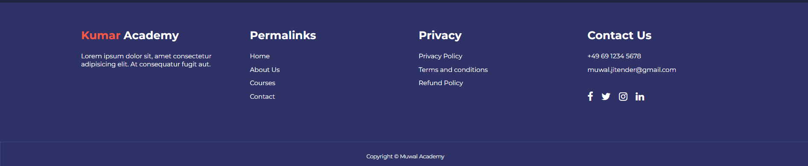
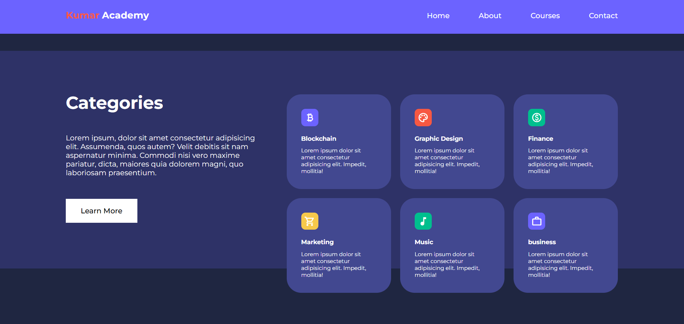
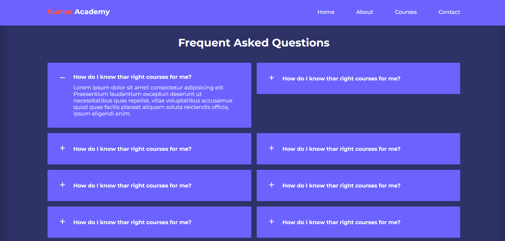
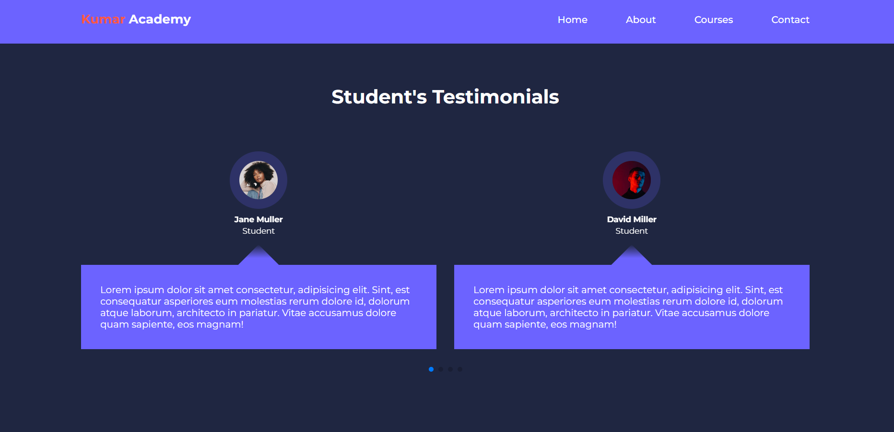
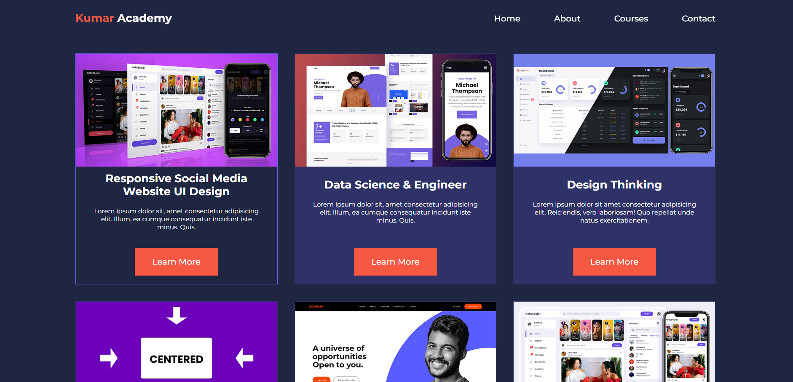
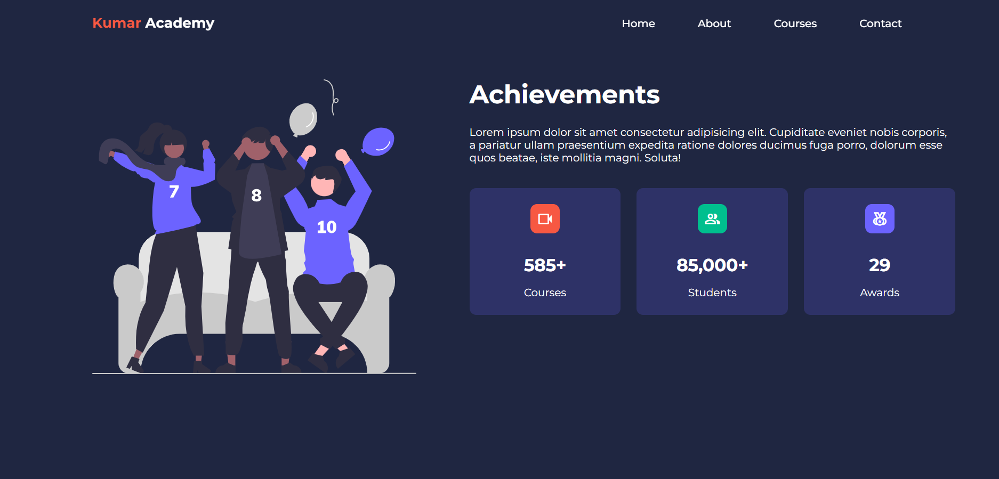
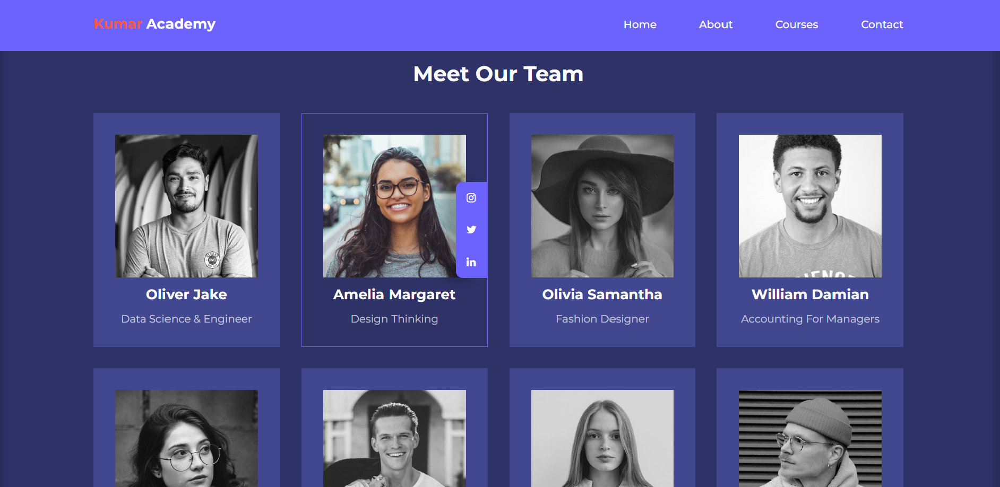
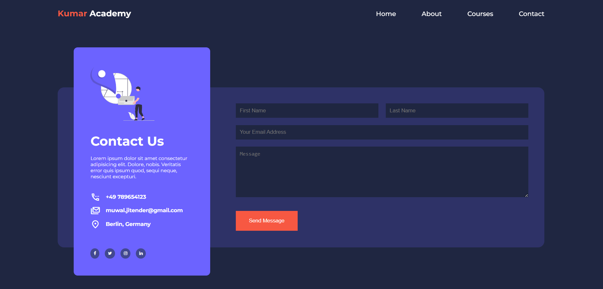

# Kumar Academy Website

## Overview

Kumar Academy is an educational platform aimed at helping individuals grow their skills and advance their careers. The website is built with a responsive design and features multiple pages highlighting courses, achievements, contact options, and testimonials.

---

## Features

### 1. **Navigation**

- A responsive navigation bar that includes links to:
  - Home
  - About Us
  - Courses
  - Contact
- The navigation menu is dynamic and adapts to smaller screens, providing a user-friendly experience.

### 2. **Home Page**

- **Hero Section:** Promotes the mission of Kumar Academy to grow skills.
- **Categories Section:** Highlights various categories such as Blockchain, Graphic Design, Finance, and more.
- **Popular Courses:** Displays a selection of featured courses with a "Learn More" button.
- **FAQs Section:** Includes common questions with collapsible answers.
- **Testimonials Section:** Uses **SwiperJS** for a carousel-style display of student and professional feedback.

### 3. **Courses Page**

- Lists a variety of courses, including:
  - Data Science & Engineering
  - Design Thinking
  - Fullstack Development
  - Machine Learning
  - DevOps Engineering
  - Cloud Architect Solutions
- Each course includes a brief description and a "Learn More" button.

### 4. **About Page**

- **Achievements Section:** Highlights key accomplishments:
  - Over 585 courses
  - 85,000+ students
  - 29 awards
- **Meet Our Team:** Introduces the team with images, specializations, and links to their social media profiles.

### 5. **Contact Page**

- Includes:
  - Contact details (phone, email, location)
  - A **contact form** powered by **Formspree** for direct email submissions.
  - Social media links to platforms like Facebook, Twitter, Instagram, and LinkedIn.

### 6. **Footer**

- Provides additional navigation links (Home, About Us, Courses, Contact).
- Includes contact details and social media links.
- Displays copyright information for Kumar Academy.

---

## Technologies Used

1. **HTML/CSS:**

   - Core structure and styling.
   - CSS media queries for responsiveness.
   - Custom styles for different sections like About, Contact, and Courses.

2. **JavaScript:**

   - Dynamic content injection for the header and footer.
   - Toggle functionality for FAQs.
   - Show/hide navigation menu on smaller screens.

3. **External Libraries and Tools:**
   - **SwiperJS:** For carousel functionality in the testimonials section.
   - **Formspree:** To handle form submissions and send emails via the Contact Us page.
   - **Google Fonts:** For typography.
   - **Font Awesome:** For social media icons.

---

## File Structure

```plaintext
├── index.html          # Home Page
├── about.html          # About Page
├── courses.html        # Courses Page
├── contact.html        # Contact Page
├── header.html         # Header Section
├── footer.html         # Footer Section
├── css/                # Stylesheets
│   ├── style.css       # Global Styles
│   ├── about.css       # Styles for About Page
│   ├── contact.css     # Styles for Contact Page
│   ├── courses.css     # Styles for Courses Page
├── scripts/            # JavaScript Files
│   ├── main.js         # Main JS Logic
│   ├── inject-links.js # Dynamically Inject External Links
├── images/             # Images Used in the Website
```

---

## Screenshots

Please attach screenshots of the following:

1. **Home Page:** Highlighting the hero section and categories.

   
   

   

   

   

2. **Courses Page:** Showing the variety of courses offered.



3. **About Page:** Featuring the achievements and team sections.





4. **Contact Page:** Showcasing the contact form and social media links.



---

## How to Run

1. Clone the repository:
   ```bash
   git clone https://github.com/your-username/kumar-academy.git
   ```
2. Open the project in your code editor.
3. Launch the `index.html` file in your browser to view the website.

---

## Future Enhancements

- Add a backend system for dynamic course management.
- Integrate a database for storing form submissions.
- Enhance the design of the FAQ section with animations.

---

## Credits

- Designed and developed by **Jitender Kumar**.
- Email: [muwal.jitender@gmail.com](mailto:muwal.jitender@gmail.com).
- LinkedIn: [Jitender Kumar](https://www.linkedin.com/in/jitender-muwal/).

---
